# Design

# Systems

## Waiting room
* 1 waiting room only
* Check occupacy

## Login page
* Username only
* Username allow empty (will use random name)

## Game room
* Tiles
* Reserve cards
* Pool
    * Money
    * Employee
    * Milestones
    * Road
    * Park
    * Garden
    * House
    * Advertises
* Player
    * Coffee shops
    * Shops
    * Foods
    * Milestones
    * Employee
        * On duty
        * Advertising
    * Deck
    * Money

# Steps
## Initialize
## Game start
## Step 1 Restructing
## Step 2 Order of business
## Step 3 Working 9:00-5:00
## Step 4 Dinnertime (breaking the bank)
## Step 5 Payday
## Step 6 Marketing Campaigns
## Step 7 Clean up
## Summarize

# Limitations
* 2-6(7+ player will be speculate)

# Others
* Player as interface (Human/AI)

# Future work

* Tournaments
* Rank
* Shop skins
* Animations